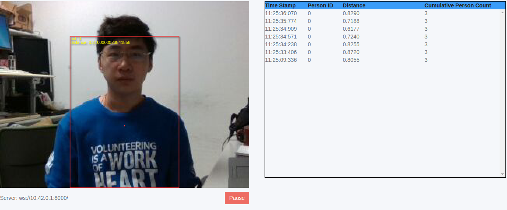
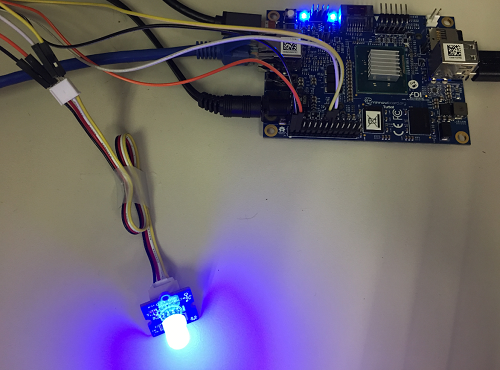

# Demo 1

This GUI app displays the live color preview from the camera within a browser and draw red rectangles around the person(s) detected in the camera frame with a color dot indicating the center of mass for the detected persons in the frame. It also displays the Person ID (pid) for every person and the distance from person to camera. Upon the distance, app could control the light turn on/off automatically.
When people in the 0.5 ~ 1 meter from camera, light will be on blue, and when people move to 1 ~ 1.5 meter from camera light will be on red. The expected of light color should be as below:

| Distance(Meter) | Expected Behavior |
|:--------:|:------:|
| 0.5 ~ 1 | Blue |
| 1 ~ 1.5 | Red |
| 1.5 ~ 2 | White |
| 2 ~ 2.5 | Green |

## Bootstrap

```
$ npm install
```

## Run

```
$ node main.js
```

Note: Open a brower in any remote machine that is on the same network as target, enter url "TargetIPaddr:8000/view.html". Ex:10.30.90.130:8000/view.html, it without network, please open url "127.0.0.1:8000/view.html".

## Screenshot

When person in front of camera at different distance, light* turns on blue color(* means blue, red, white, green).




* Known issue: This demo doesn't support recognized mutil-user at the same time as it can't contorl mutil-led which using same resourceType, see issue [#1383](https://github.com/01org/zephyr.js/issues/1383), if there are two persons in front of camera at different distance, this demo will choose the person which pid is smaller. The data of pid and distance have been showed in the red rectangless. For example, person A's pid is 1, person B is 2, this demo will according to the distance of A to display which color. 