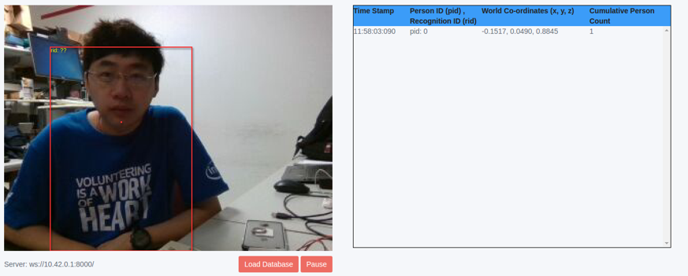
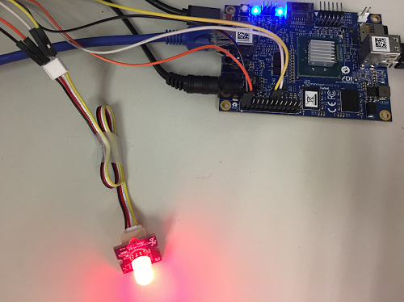
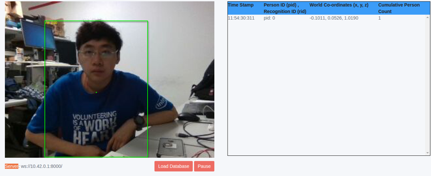
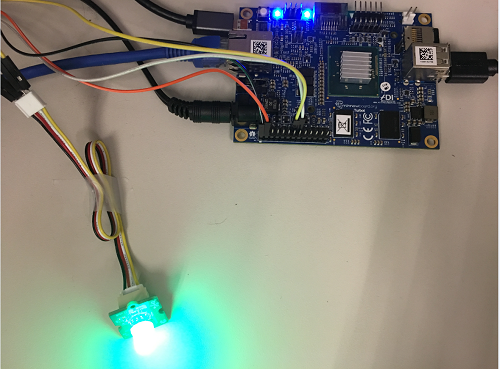

# Demo 2 

This GUI app illustrates how to register new users to the database and identify them when they appear in the scene. It displays the live color preview from the camera within a browser and draw red rectangles around the person(s) detected in the camera frame with a color dot indicating the center of mass for the detected persons in the frame. It also displays the Person ID (pid) for every person detected which is temporary id for the person. Mouse click in any of the detected person's rectangle, activates registration for that person and saves the information in a database (database name currently hardcoded) with a Recognition ID (rid) assigned to that person, when this operation executes correctlly, the color of rectangle around the person will turn to green. Clicking on the load database button, loads the database that has information about the recognized persons, displays a green rectangle and the rid of already registered peson when they are present in the FOV.

## Bootstrap

```
$ npm install
```

## Run

```
$ node main.js
```

Note: Open a brower in any remote machine that is on the same network as target, enter url "TargetIPaddr:8000/view.html". Ex:10.30.90.130:8000/view.html, it without network, please open url "127.0.0.1:8000/view.html".
Person can be recognized and the recognition database can be stored when clicking the person to track him/her. The stored database can also be loaded.

## Screenshot

1. When person is not recognized, light is on red and buzzer turns on.




2. Click person's box on the screen, the person will be recognized and store in database. The light will be on green. (If you want to clear the database, remove DB file `./demo2/person_recognition_id.db` directly.)



