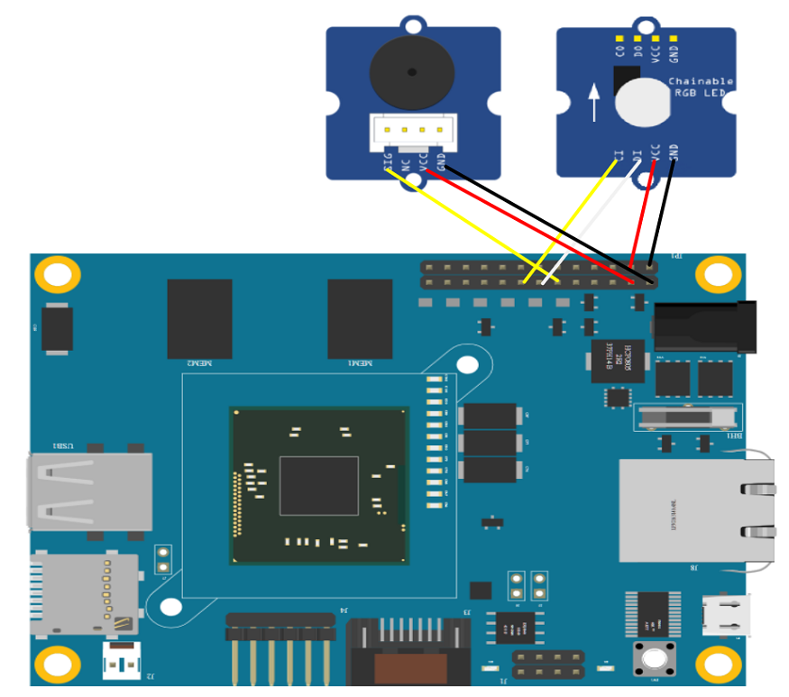

# JavaScript OCF servers
This folder contains JavaScript implementation of the following OCF servers:
* Buzzer (x1)
* RGB LED (x1)

# Setting up the OCF servers
## Setting up the HW
You need the devce and sensors in the following list:
* 1 x [MinnowBoard Turbot](https://store.netgate.com/Turbot2.aspx)
* 1 x [Grove Buzzer](http://www.seeedstudio.com/wiki/Grove_-_Buzzer)
* 1 x [Grove Chainable RGB LED](http://www.seeedstudio.com/depot/twig-chainable-rgb-led-p-850.html?cPath=156_157)

### Wiring
For MinnowBoard Turbot pin number, please refer to [here](https://github.com/intel-iot-devkit/mraa/blob/master/docs/minnow_max.md#interface-notes)

|       Sensor      |   Pin  |          Link            |
|:-----------------:|:------:|:------------------------:|
| Buzzer            |   GPIO 12   |[Grove Buzzer](https://www.seeedstudio.com/Grove-Buzzer-p-768.html) |
| RGB LED |  	14--Clock, 16--Data | [Grove Chainable RGB LED](http://www.seeedstudio.com/depot/twig-chainable-rgb-led-p-850.html?cPath=156_157) |

Mount RGB LED with MinnowBoard Turbot as shown in the following picture(buzzer need to connect `SIG` to Pin `GPIO 12`):

